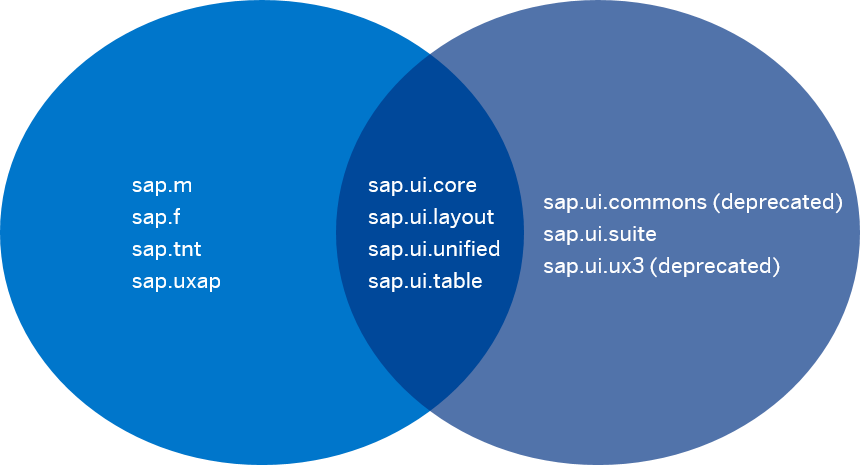

<!-- loio363cd16eba1f45babe3f661f321a7820 -->

| loio |
| -----|
| 363cd16eba1f45babe3f661f321a7820 |

view on: [demo kit nightly build](https://openui5nightly.hana.ondemand.com/#/topic/363cd16eba1f45babe3f661f321a7820) | [demo kit latest release](https://openui5.hana.ondemand.com/#/topic/363cd16eba1f45babe3f661f321a7820)

## Supported Library Combinations

OpenUI5 provides a set of JavaScript and CSS libraries, which can be combined in an application using the combinations that are supported.

***

There are two sets of possible library combinations, which are best described using the diagram below. Any of the libraries listed on the lefthand side can be used with those listed in the middle, and any of the libraries listed on the righthand side can be used with the ones listed in the middle. The libraries listed on the lefthand side **cannot** be used in combination with the libraries listed on the right, and vice versa:

> Note:
> Libraries that are not mentioned explicitly, belong to the lefthand side.
> 
> 

  

**Related information**  

[Deprecated Themes and Libraries](Deprecated_Themes_and_Libraries_a87ca84.md)

