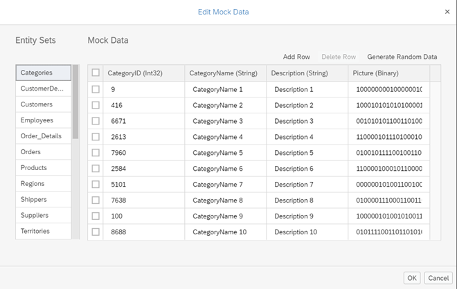

<!-- loio6256083b146e40b896309ead6ccd8751 -->

| loio |
| -----|
| 6256083b146e40b896309ead6ccd8751 |

view on: [demo kit nightly build](https://openui5nightly.hana.ondemand.com/#/topic/6256083b146e40b896309ead6ccd8751) | [demo kit latest release](https://openui5.hana.ondemand.com/#/topic/6256083b146e40b896309ead6ccd8751)

## Testing

The templates include basic testing features, unit tests as well as integration tests for a basic test coverage of the initial app. The tests are written independently of the actual data displayed in the app.

The `webapp` folder of the template app contains a `test.html` file which serves as an overview for the different test pages. You can run the app with or without mock data and run the unit and integration tests. This section describes which application tests are provided and how they are structured.

***

### Custom Mock Data

To run the automated tests below, we need a stable reference between the item on the master page and the items displayed in the line item table on the detail page. The mock server we use to simulate a backend system is capable of creating random entities suitable for testing, but it cannot foresee the dependency between the entity sets.

After creating this template, we therefore need to create mock data to successfully run all automated tests delivered with this template.

In SAP Web IDE, you can easily create mock data that fulfill the conditions above: Right-click on the `metadata.xml` file in the `localService` folder of your template project, and select *Edit Mock Data*. Select the entity sets that you have chosen for the master page and the detail page, and choose *Generate Random Data*. The generated files will be put in the folder `localService/mockdata`.

   
  
Screenshot of the Edit Mock Data dialog<a name="loio6256083b146e40b896309ead6ccd8751__fig_twp_mws_l2b"/>

  

You can also manually download a set of json files from the actual service by appending `$format=json` to the corresponding URL. Download the resulting files, and put them in the `localService/mockdata` folder within the template project.

For more information, see [Step 2: Custom Mock Data](Step_2_Custom_Mock_Data_3118903.md) in our Worklist App tutorial.

***

### Integration Tests

The integration tests shipped with the template cover all basic functionality and provide several "journeys". Journeys include a series of OPA tests that belong to the same functionality and should be executed together. Some of the journeys are implemented for both phone and desktop use cases to test device-specific interaction steps:

-   `BusyJourney` / `BusyJourneyPhone`: This journey tests the busy indication features of the app for phone and other devices.

-   `NavigationJourney` / `NavigationJourneyPhone`: This journey will trigger user interactions and navigate through the application. The routing configuration, basic navigation events, and error handling are tested here.

-   `NotFoundJourney/NotFoundJourneyPhone`: Several "not found" cases of the application are tested here. Faulty navigation scenarios are introduced intentionally to simulate errors.

-   `MasterJourney`: Tests for the *Master* page that check the search, sorting, filtering and grouping features built into the app.

-   `FLPIntegrationJourney`: This journey is available if you have enabled SAP Fiori launchpad \(FLP\) for your app. It tests the FLP integration features *Save as tile* and *Share on SAP Jam*.

-   `AllJourneys`: This is a convenience journey that will call all the other journeys specified above and is used in the test suite file.

You can execute all journeys by calling the test suite file `opaTests.qunit.html` or `opaTestsPhone.qunit.html` in the `webapp/test/integration` folder or selecting the *run all integration tests* link in the `test.html` file in the app’s root folder.

For more information, see [Integration Testing with One Page Acceptance Tests \(OPA5\)](Integration_Testing_with_One_Page_Acceptance_Tests_(OPA5)_2696ab5.md) and [sap.ui.test.Opa5](https://openui5.hana.ondemand.com/explored.html#/entity/sap.ui.test.Opa5/samples) in the *Samples* within the Demo Kit.

***

### Unit Tests

In the `unit` subfolder you can find all unit tests for our application. They are structured similarly to the structure of the `webapp` folder. For example, controller tests are located in the `controller` folder whereas formatter tests are located in the `model` folder.

Unit tests are included for the following functionality:

-   ListSelector tests
-   Formatters
-   Device model

As with the integration tests, you can execute all unit tests by calling the test suite file `unitTests.qunit.html` in the `webapp/test/unit` folder or selecting the *run all unit tests* link in the `test.html` file in the app’s root folder.

For more information, see [Unit Testing with QUnit](Unit_Testing_with_QUnit_09d145c.md), [https://qunitjs.com/](https://qunitjs.com/) and [http://sinonjs.org/](http://sinonjs.org/).

