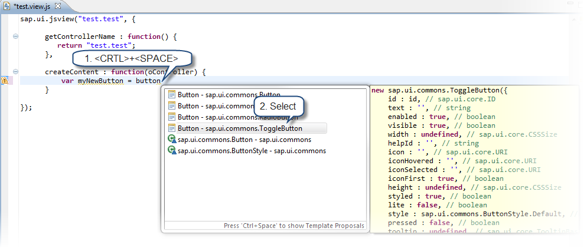
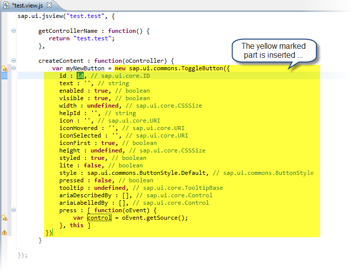

<!-- loiofcf5e9b5068f4e008779e520e546604b -->

| loio |
| -----|
| fcf5e9b5068f4e008779e520e546604b |

view on: [demo kit nightly build](https://openui5nightly.hana.ondemand.com/#/topic/fcf5e9b5068f4e008779e520e546604b) | [demo kit latest release](https://openui5.hana.ondemand.com/#/topic/fcf5e9b5068f4e008779e520e546604b)

## Use JavaScript and XML Templates

You can add SAPUI5 control-specific templates for JavaScript code. Such templates are available, for example, in JavaScript views of SAPUI5 application tools development.

***

SAPUI5 provides the possibility to add SAPUI5 control specific templates for JavaScript and XML code. These templates are available, for example, in JavaScript and XML views of SAPUI5 Application development. They are generated during startup of the Eclipse runtime.

The templates are an overview over all available

-   control properties
-   aggregations
-   associations and
-   events

To use the JavaScript and XML templates, the SAPUI5 application development tools feature has to be installed in your Eclipse.

1.  To insert a template, open the JavaScript editor.

2.  Start typing the name of the respective control or the name of the alias, for example *button*.

3.  Choose * CRTL SPACE * and choose the control from the code completion list.

    

    All properties and events are inserted.

    

