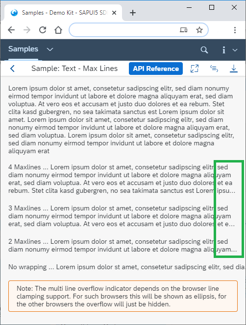
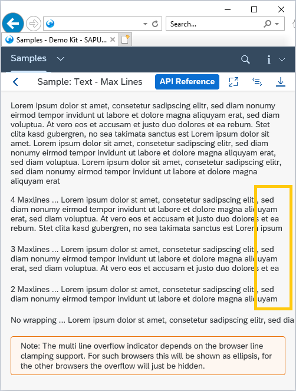

<!-- loiof08f29636be1472dac8f35fe7918ee08 -->

| loio |
| -----|
| f08f29636be1472dac8f35fe7918ee08 |

view on: [demo kit nightly build](https://openui5nightly.hana.ondemand.com/#/topic/f08f29636be1472dac8f35fe7918ee08) | [demo kit latest release](https://openui5.hana.ondemand.com/#/topic/f08f29636be1472dac8f35fe7918ee08)

## Visual Degradations

Depending on the combination of device and browser, visual degradations may occur in the `sap.m` library.

The following sections give an overview of the known degradations.

***

### sap.m.Text - maxLines \(property\), sap.m.Text - text \(property\), sap.m.ObjectListItem - title \(property\), sap.m.ObjectHeader - title \(property\)

The visual aid for indicating multiline overflow is an ellipsis at the end of a line. This ellipsis is displayed if the text string exceeds the maximum number of lines displayed on screen. Depending on the line-clamping support offered by your browser, this visual aid may not be displayed at all, meaning the text is simply truncated without any visual indication that it is incomplete. The table below outlines which browsers fail to support the multiline ellipsis handling of the `maxLines` property, and also shows examples the visual degradation along with what the display should look like when it is supported:

 <a name="loiof08f29636be1472dac8f35fe7918ee08__table_epw_lwr_tkb"/>maxLines Visual Degradations

 > **Warning:** The below table contains complex elements that cannot not be displayed within a simple markdown table. It has been automatically converted to an HTML table. It's design may vary from the source page!

<table>
	<thead>
		<tr>
			<th>What it Should Look Like</th>
			<th>Visual Degradation</th>
		</tr>
	</thead>
	<tbody>
		<tr>
			<td>Google Chrome</td>
			<td>Internet Explorer 11</td>
		</tr>
		<tr>
			<td>  

 
			</td>
			<td>  

 
			</td>
		</tr>
	</tbody>
</table>

***

### Placeholder Property in `sap.m.TextArea`

As there is no W3C specification for how to use the placeholder property, browser handling for this property varies. Some browsers use a native placeholder property, but for browsers that do not support this, SAP implements its own placeholder version.

`sap.m.TextArea` is a multiline control and behaves differently according to the browser:

 > **Warning:** The below table contains complex elements that cannot not be displayed within a simple markdown table. It has been automatically converted to an HTML table. It's design may vary from the source page!

<table>
	<thead>
		<tr>
			<th>Browser</th>
			<th>Situation</th>
		</tr>
	</thead>
	<tbody>
		<tr>
			<td>Google Chrome</td>
			<td>Google Chrome supports the native placeholder property and displays multiple lines along with a scrollbar 

 
			</td>
		</tr>
		<tr>
			<td>Mozilla Firefox</td>
			<td>Mozilla Firefox supports the native placeholder property but does not display a scrollbar or an ellipsis, instead it simply truncates the placeholder text string 

 
			</td>
		</tr>
	</tbody>
</table>

