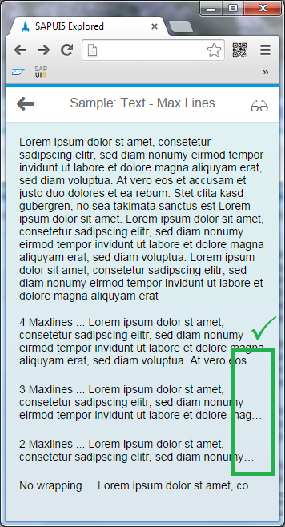
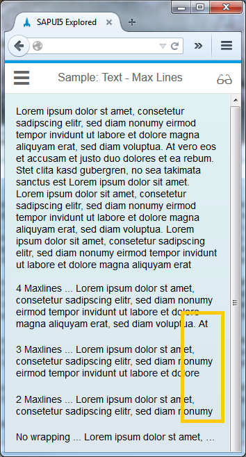
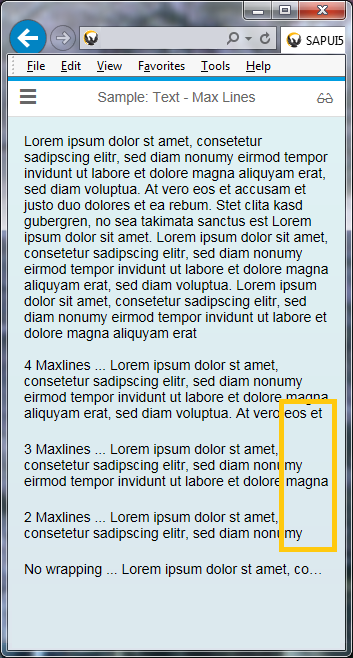
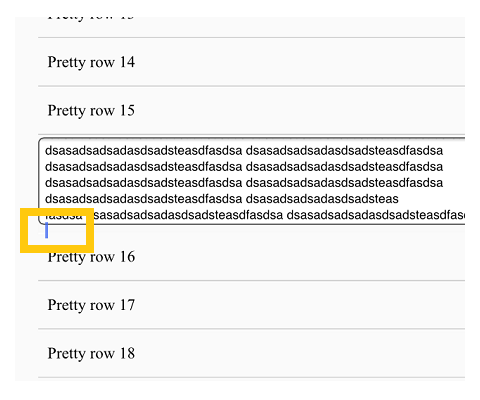
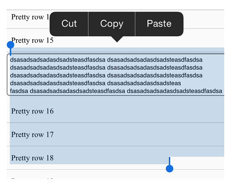

<!-- loiof08f29636be1472dac8f35fe7918ee08 -->

| loio |
| -----|
| f08f29636be1472dac8f35fe7918ee08 |

view on: [demo kit nightly build](https://openui5nightly.hana.ondemand.com/#/topic/f08f29636be1472dac8f35fe7918ee08) | [demo kit latest release](https://openui5.hana.ondemand.com/#/topic/f08f29636be1472dac8f35fe7918ee08)

## Visual Degradations

Depending on the combination of device and browser, visual degradations may occur in the `sap.m` library.

The following sections give an overview of the known degradations.

***

### sap.m.Text - maxLines \(property\), sap.m.Text - text \(property\), sap.m.ObjectListItem - title \(property\), sap.m.ObjectHeader - title \(property\)

The visual aid for indicating multiline overflow is an ellipsis at the end of a line. This ellipsis is displayed if the text string exceeds the maximum number of lines displayed on screen. Depending on the line-clamping support offered by your browser, this visual aid may not be displayed at all, meaning the text is simply truncated without any visual indication that it is incomplete. The table below outlines which browsers fail to support the multiline ellipsis handling of the `maxLines` property, and also shows examples of each visual degradation along with what the display should look like in each case:

maxLines Visual Degradations<a name="loiof08f29636be1472dac8f35fe7918ee08__table_db3_rnj_cp"/>

 > **Warning:** The below table contains complex elements that cannot not be displayed within a simple markdown table. It has been automatically converted to an HTML table. It's design may vary from the source page!

<table>
	<thead>
		<tr>
			<th>What it Should Look Like</th>
			<th>Visual Degradation</th>
		</tr>
	</thead>
	<tbody>
		<tr>
			<td>Google Chrome</td>
			<td>Mozilla Firefox</td>
			<td>Internet Explorer 10</td>
		</tr>
		<tr>
			<td>  

 
			</td>
			<td>  

 
			</td>
			<td>  

 
			</td>
		</tr>
	</tbody>
</table>

***

### placeholder Property in sap.m.Input and sap.m.TextArea

As there is no W3C specification for how to use the placeholder property, browser handling for this property varies greatly. Some browsers use a native placeholder property, but for browsers that do not support this, SAP implements its own placeholder version.

The following overview outlines which browsers use which version, and which limitations or degradations apply in each case for the `sap.m.Input` control and `sap.m.TextArea` control.

placeholder Property in sap.m.Input<a name="loiof08f29636be1472dac8f35fe7918ee08__table_b3z_qkn_pp"/>

 > **Warning:** The below table contains complex elements that cannot not be displayed within a simple markdown table. It has been automatically converted to an HTML table. It's design may vary from the source page!

<table>
	<thead>
		<tr>
			<th>Browser</th>
			<th>Situation</th>
		</tr>
	</thead>
	<tbody>
		<tr>
			<td>Google Chrome</td>
			<td>Google Chrome supports the native placeholder property and displays the ellipsis correctly, indicating that the placeholder text stretches beyond the field that is currently visible 

 
			</td>
		</tr>
		<tr>
			<td>Internet Explorer Version 11</td>
			<td>This version supports the native placeholder property but does not display the ellipsis, instead it simply truncates the placeholder text string 

 
 > Note:
 > If you focus in the field, the placeholder disappears from view. If you leave the focus without typing anything, the placeholder is then displayed again.
			</td>
		</tr>
		<tr>
			<td>Mozilla Firefox</td>
			<td>Mozilla Firefox currently supports the native placeholder property and displays the ellipsis correctly, indicating that the placeholder text stretches beyond the field that is currently visible 

 
			</td>
		</tr>
	</tbody>
</table>

Whereas `sap.m.Input` contains just a single line placeholder, `sap.m.TextArea` is a multiline control, meaning it brings with it different issues to the ones listed above. These issues are different depending on the browser and are listed below.

placeholder Property in sap.m.TextArea<a name="loiof08f29636be1472dac8f35fe7918ee08__table_jhl_ykn_pp"/>

 > **Warning:** The below table contains complex elements that cannot not be displayed within a simple markdown table. It has been automatically converted to an HTML table. It's design may vary from the source page!

<table>
	<thead>
		<tr>
			<th>Browser</th>
			<th>Situation</th>
		</tr>
	</thead>
	<tbody>
		<tr>
			<td>Google Chrome</td>
			<td>Google Chrome supports the native placeholder property and displays multiple lines along with a scrollbar 

 
			</td>
		</tr>
		<tr>
			<td>Internet Explorer Version 11</td>
			<td>This version does not use the native placeholder property, instead it uses the placeholder version developed by SAP. This browser displays multiple lines along with a scrollbar. 

 
 > Note:
 > Clicking the scrollbar sets focus from a technical perspective, meaning the placeholder text disappears and makes scrolling impossible. Scrolling with the mouse wheel does not set focus, and enables you to read the entire placeholder text.
			</td>
		</tr>
		<tr>
			<td>Mozilla Firefox</td>
			<td>Mozilla Firefox supports the native placeholder property but does not display a scrollbar or an ellipsis, instead it simply truncates the placeholder text string 

 
			</td>
		</tr>
	</tbody>
</table>

***

### Issues Affecting sap.m.TextArea on iOS Devices

> Note:
> There are several issues affecting iOS devices \(as of version iOS 5\), which are often mistakenly identified as errors relating to `sap.m.TextArea` rendering. These are **not** visual degradations relating to `sap.m`. These rendering errors are inherent to the iOS operating system as of version 5, and also occur even when OpenUI5 is not used at all, as shown in the examples below.
> 
> |Problem|Description|
> |-------|-----------|
> |   
> 
>  |When the text entered inside a text box is long and does not fit into the fixed visible text area, the cursor then appears outside of the visible text box, as shown in the graphic.|
> |   
> 
>  |When choosing *Select All* to copy the contents of a text box on an iOS device, the selection marked in blue continues outside the boundaries of the visible text area, as shown in the graphic.|
> 
> 

