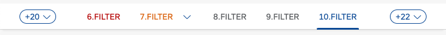

<!-- loioe9c83569a4a54f04a349c4152358f4ff -->

| loio |
| -----|
| e9c83569a4a54f04a349c4152358f4ff |

view on: [demo kit nightly build](https://openui5nightly.hana.ondemand.com/#/topic/e9c83569a4a54f04a349c4152358f4ff) | [demo kit latest release](https://openui5.hana.ondemand.com/#/topic/e9c83569a4a54f04a349c4152358f4ff)

## What's New in OpenUI5 1.93

With this release OpenUI5 is upgraded from version 1.92 to 1.93.

***

<a name="loioe9c83569a4a54f04a349c4152358f4ff__section_qwl_pb5_zcb"/>

### Improved Features

<table>
<tr>
<td>

**OpenUI5 Data Types**

The new version of OpenUI5 introduces a new `skipDecimalsValidation` constraint for the `sap.ui.model.odata.type.Unit` and `sap.ui.model.odata.type.Currency` data types. It allows you to switch off validation on the number of decimals.

</td>
</tr>
<tr>
<td>

**OpenUI5 OData V2 Model**

The new version of the OpenUI5 OData V2 model introduces the following features:

-   An OData V2-specific context, `sap.ui.model.odata.v2.Context`. Methods of the OData V2 model now return this context instead of the basis context, `sap.ui.model.Context`.

-   The new `sap.ui.model.ListBinding#getCount` method, which returns the count of entries in a list.

</td>
</tr>
<tr>
<td>

**OpenUI5 OData V4 Model**

The new version of the OpenUI5 OData V4 model introduces the following features:

-   A `search` property in the `$$aggregation` binding parameter that allows you to specify a search that is executed before the aggregation. Note that this requires the service to support the `search` transformation in `$apply`. For more information, see [Search Before Data Aggregation](Extension_for_Data_Aggregation_7d91431.md#loio7d914317c0b64c23824bf932cc8a4ae1__section_SBDA).

-   A `retryAfter` property in the technical details of a message originating from a response with a `Retry-After` header. For more information, see [Accessing the HTTP Status Code](Server_Messages_in_the_OData_V4_Model_fbe1cb5.md#loiofbe1cb5613cf4a40a841750bf813238e__section_httpStatus).

</td>
</tr>
</table>

***

<a name="loioe9c83569a4a54f04a349c4152358f4ff__section_rqn_wd5_zcb"/>

### Improved Controls

<table>
<tr>
<td>

**`sap.f.DynamicPage`**

With the new `headerPinned` property and `headerContentPinnedStateChange` event, you can now control the pinned state of the `DynamicPageHeader` programmatically.For more information, see the [API Reference](https://openui5.hana.ondemand.com/#/api/sap.f.DynamicPage).

</td>
</tr>
<tr>
<td>

**`sap.m.IconTabBar`**

-   We have updated the design of the overflow tab according to the latest SAP Fiori guidelines.

    

    Additionally, when using the `StartAndEnd` tab overflow mode, both overflow tabs will display the number of tabs that they hold.

    

    For more information, see the [Sample](https://openui5.hana.ondemand.com/#/entity/sap.m.IconTabBar/sample/sap.m.sample.IconTabBarStartAndEndOverflow).

-   When the control is used in `Inline` header mode, icons can be added in front of the tab-filter titles. This allows, for example, the `sap.m.IconTabBar` control to be used as a horizontal navigation in the `sap.tnt.ToolHeader`. For more information, see the [Sample](https://openui5.hana.ondemand.com/#/entity/sap.m.IconTabBar/sample/sap.m.sample.IconTabBarInlineIcons).

</td>
</tr>
<tr>
<td>

**`sap.m.List, sap.m.Table, sap.m.Tree`**

We have provided a new toggle option in multi-selection mode for these controls: If the new `multiSelectMode` property has the `Default` value, the table renders the *Select All* checkbox in the column header as before. If the value of the property is `ClearAll`, the *Select All* checkbox and the related feature are no longer available. The list or table then provides an option to deselect all selected items at once. For more information, see the [API Reference](https://openui5.hana.ondemand.com/#/api/sap.m.ListBase%23methods/getMultiSelectMode) and the [Sample](https://openui5.hana.ondemand.com/#/entity/sap.m.Table/sample/sap.m.sample.TableMultiSelectMode).

</td>
</tr>
<tr>
<td>

**`sap.m.MultiComboBox`**

We have the range selection functionality in `sap.m.MultiComboBox`. Two new parameters have been introduced to the `selectionChange` event: `changedItems` and `selectAll`. Users can now select a group of items by holding the [Shift\] key and selecting the checkboxes of the first and the last items from the desired group. For more information, see the [Sample](https://openui5.hana.ondemand.com/#/entity/sap.m.MultiComboBox/sample/sap.m.sample.MultiComboBox).

</td>
</tr>
<tr>
<td>

**`sap.m.PlanningCalendar`**

-   Application developers can now define relative timeframes that are different from the absolute values in the calendar. A relative view displays periods that are relative to a given custom start date. Common use-case scenarios include Week X, Day X \(since the start of a project\), etc. This feature is in experimental state. For more information, see the [API Reference](https://openui5.hana.ondemand.com/#/api/sap.m.PlanningCalendarView) and the [Sample](https://openui5.hana.ondemand.com/#/entity/sap.m.PlanningCalendar/sample/sap.m.sample.PlanningCalendarRelativeViews). 

-   We have introduced \(in experimental state\) a way to place custom content inside the `CalendarAppointment` control for non-SAP Fiori \(custom\) applications with a freestyle nature. When the `customContent` aggregation is used, the `title`, `text`, `description`, and `icon` properties of the appointment are ignored. The application developer must ensure that all of the accessibility requirements are met, and that the height of the content conforms with the height provided by the appointment. We do not recommend using interactive controls as content, as they may trigger unwanted selection of the appointment with unpredictable results. For more information, see the [API Reference](https://openui5.hana.ondemand.com/#/api/sap.ui.unified.CalendarAppointment).

</td>
</tr>
<tr>
<td>

**`sap.m.SelectDialog`, `sap.m.TableSelectDialog`**

The `updateStarted`, `updateFinished`, and `selectionChange` events from an inner list or a table are now exposed to the `sap.m.SelectDialog` and `sap.m.TableSelectDialog` controls. Application developers can use these events to achieve lazy loading with JSON model. For more information, see the [Sample](https://openui5.hana.ondemand.com/#/entity/sap.m.SelectDialog/sample/sap.m.sample.SelectDialogLazyLoading).

</td>
</tr>
<tr>
<td>

**`sap.tnt.ToolPage`**

We have added a new `subHeader` aggregation to the control. You can use it to create a horizontal navigation bar in the tool page layout. For more information, see the [Sample](https://openui5.hana.ondemand.com/#/entity/sap.tnt.ToolPage/sample/sap.tnt.sample.ToolPageNavigation).

</td>
</tr>
<tr>
<td>

**`sap.ui.integration.widgets.Card`**

-   We have introduced a Configuration Editor tool that supports the card integration process on the customer side. Roles that can use the Configuration Editor include local administrators, page/content administrators, and translators. For more information, see the [Configuration Editor](https://openui5.hana.ondemand.com/test-resources/sap/ui/integration/demokit/cardExplorer/webapp/index.html#/designtime/overview) section and a [Card Sample](https://openui5.hana.ondemand.com/test-resources/sap/ui/integration/demokit/cardExplorer/webapp/index.html#/explore/list) in the Card Explorer.

-   We have added \(in experimental state\) a new feature, and now Integration cards can have a footer with actionable buttons. Additionally, the List type card is enhanced and now list items support the same actionable buttons, including the option to remove the item. This behavior is achieved using the new `actionsStrip` \(experimental\) property that describes all buttons and their behavior. For more information, see the [Footer](https://openui5.hana.ondemand.com/test-resources/sap/ui/integration/demokit/cardExplorer/webapp/index.html#/learn/footer), and [List Card](https://openui5.hana.ondemand.com/test-resources/sap/ui/integration/demokit/cardExplorer/webapp/index.html#/learn/types/list) sections, and the [Footer](https://openui5.hana.ondemand.com/test-resources/sap/ui/integration/demokit/cardExplorer/webapp/index.html#/explore/footer) and [List Card Quick Actions](https://openui5.hana.ondemand.com/test-resources/sap/ui/integration/demokit/cardExplorer/webapp/index.html#/explore/list/quickActions) samples in the Card Explorer.

</td>
</tr>
<tr>
<td>

**`sap.uxap.ObjectPageLayout`**

With the new `headerContentPinned` property and `pinnedStateChange` event, you can now control the pinned state of the `DynamicPageHeader` programmatically.For more information, see the [API Reference](https://openui5.hana.ondemand.com/#/api/sap.uxap.ObjectPageLayout).

</td>
</tr>
</table>

***

<a name="loioe9c83569a4a54f04a349c4152358f4ff__section_cps_cg5_zcb"/>

### Deprecations

<table>
<tr>
<td>

There are currently no major deprecations. For a complete list of all deprecations, see [Deprecated APIs](https://openui5.hana.ondemand.com/#/api/deprecated). 

</td>
</tr>
</table>

***

<a name="loioe9c83569a4a54f04a349c4152358f4ff__section_r5v_3h5_zcb"/>

### Demo Kit Improvements

<table>
<tr>
<td>

**Change Version Dialog**

We have improved the *Change Version* dialog to help you find the desired version faster. We grouped the patch numbers according to minor version, and we added a search field.

</td>
</tr>
</table>

