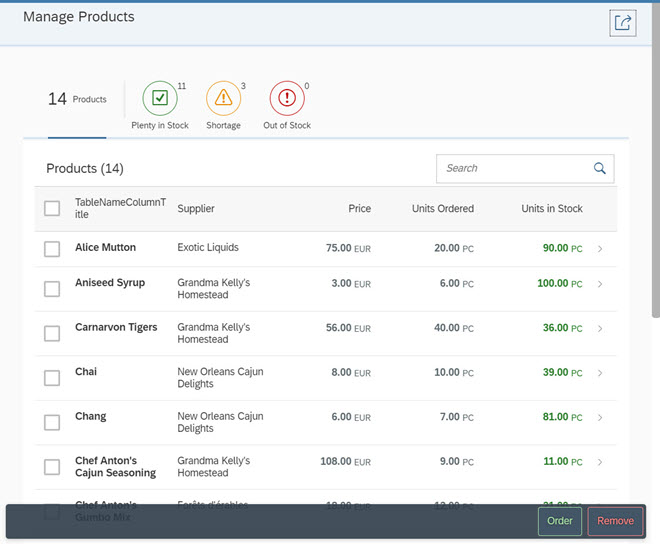
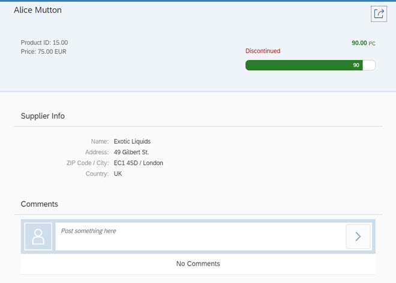

<!-- loio6a6a621c978145ad9eef2b221d2cf21d -->

| loio |
| -----|
| 6a6a621c978145ad9eef2b221d2cf21d |

view on: [demo kit nightly build](https://openui5nightly.hana.ondemand.com/#/topic/6a6a621c978145ad9eef2b221d2cf21d) | [demo kit latest release](https://openui5.hana.ondemand.com/#/topic/6a6a621c978145ad9eef2b221d2cf21d)

## Worklist App

In this tutorial we will build an app using OpenUI5 that, for example, a shop owner can use to manage his product stock levels.

The app provides the following features:

-   Overview of all products

-   Track products with shortages or products that are completely out of stock

-   Reorder products that are low in stock

-   View product details and add comments

We will use the worklist template as a starting point for this tutorial and add additional features to the app as we go through the steps. The template implements a typical "Worklist" floorplan, one of the patterns that are specified by the SAP Fiori design guidelines, but you can also use it as a starting point for easily creating any kind of list-based apps. For more information about worklist floorplans, see the *Related Information* section at the bottom of this topic.

***

### Preview

   
  
Start page of the app with list of products and actions<a name="loio6a6a621c978145ad9eef2b221d2cf21d__fig_swx_sgp_zt"/>

  

   
  
Product detail page of the app<a name="loio6a6a621c978145ad9eef2b221d2cf21d__fig_wnz_wgp_zt"/>

  

***

### Choose your development environment

You can do this tutorial either with SAP Web IDE or choose your own development environment:

-   If you use SAP Web IDE, you don't need to set up a development environment, a server and so on. All you need is a browser and an account for the SAP Cloud Platform. If you don't have an account yet, you can easily get a trial account. We recommend to continue with the SAP Web IDE as it has out-of-the-box support for SAPUI5 and because there is no setup overhead at all.

    In this case, you start with the template that is available in SAP Web IDE as described in option 1 for step 1 of this tutorial \(see [Step 1 \(Option 1\): Creating the Initial App with an App Template in SAP Web IDE](Step_1_(Option_1)_Creating_the_Initial_App_with_an_App_Template_in_SAP_Web_IDE_0c5dc93.md)\).

-   If you want to use your local development environment and deploy to any Web server of your choice, you download the code for step 1 from the Demo Kit at [Worklist App](https://openui5.hana.ondemand.com/explored.html#/entity/sap.m.tutorial.worklist/samples). In this case, start with option 2 for step 1 of this tutorial \(see [Step 1 \(Option 2\): Downloading the Code](Step_1_(Option_2)_Downloading_the_Code_9d646de.md)\).

There might be some small differences between the worklist app code generated by the SAP Web IDE template and the code downloaded from the Demo Kit. However, the differences are small and not relevant for the purpose of this tutorial

> Note:
> You don't have to do all tutorial steps sequentially, you can also jump directly to any step you want. Just download the code from the previous step, copy it to your workspace and make sure that the application runs by calling the `webapp/test.html` file.
> 
> For more information check the following sections of the tutorials overview page \(see [Get Started: Setup and Tutorials](Get_Started_Setup_and_Tutorials_8b49fc1.md)\):
> 
> -   [Downloading Code for a Tutorial Step](Get_Started_Setup_and_Tutorials_8b49fc1.md#loio8b49fc198bf04b2d9800fc37fecbb218__tutorials_download)
> 
> -   [Adapting Code to Your Development Environment](Get_Started_Setup_and_Tutorials_8b49fc1.md#loio8b49fc198bf04b2d9800fc37fecbb218__tutorials_adaptation)
> 
> 
> 

**Related information**  

[Worklist Template](Worklist_Template_a77f2d2.md)

[Get a SAP Cloud Platform trial account](https://account.hanatrial.ondemand.com/)

