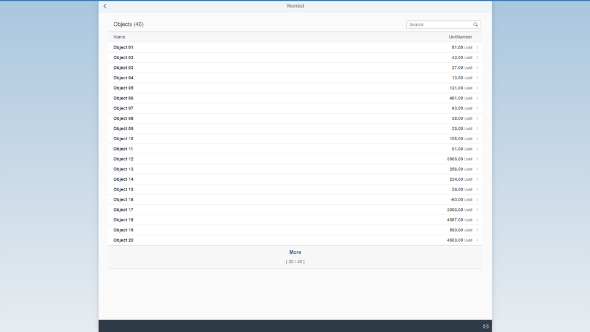

<!-- loioa77f2d29299247f8a3e30226507b1765 -->

| loio |
| -----|
| a77f2d29299247f8a3e30226507b1765 |

view on: [demo kit nightly build](https://openui5nightly.hana.ondemand.com/#/topic/a77f2d29299247f8a3e30226507b1765) | [demo kit latest release](https://openui5.hana.ondemand.com/#/topic/a77f2d29299247f8a3e30226507b1765)

## Worklist Template

The **SAP Fiori Worklist Application** template implements a typical worklist floorplan, one of the patterns that is specified by the SAP Fiori design guidelines.

A worklist displays a collection of items to be processed by the user and usually involves reviewing details of a list item and taking action. If the data needs to be organized into columns or the overview of the items is more important than showing the item details directly, this template can be used as a starting point. For more information about worklist floorplans, see the  [SAP Fiori Design Guidelines](https://experience.sap.com/fiori-design-web/).

> Note:
> You have two options: You can use this template to build an **app for the SAP Fiori launchpad \(FLP\)** or to build **standalone apps**.
> 
> -   If the app runs in FLP it also contains additional features like *Save as Tile* or *Share in SAP Jam* that depend on FLP at runtime. This app cannot be run standalone, meaning no `index.html` file is created but only files for testing the app in the FLP sandbox.
> 
> -   Only standalone apps contain an `index.html` file that is used to start the app.
> 
> 
> 

   
  
Screenshot of the Worklist App<a name="loioa77f2d29299247f8a3e30226507b1765__fig_rgl_qbz_1t"/>

  

The *Worklist* view is the main view that is initially displayed in this app. When a user clicks or taps an item in the table, the *Object* view is displayed, showing more details for the selected item. We use the semantic `FullscreenPage` control as the page for both. A `SemanticPage` is an enhanced `sap.m.Page` that contains controls with a semantic meaning and displays them according to the SAP Fiori Design Guidelines, for example. For more details about semantic controls, see the [sample](https://openui5.hana.ondemand.com/explored.html#/entity/sap.m.semantic.SemanticPage/samples) in the Demo Kit.

The table in the *Worklist* view displays a header area that shows the current amount of items in the worklist and a search field. The number of items are updated automatically and the search filters for a preconfigured column of the table.

> Note:
> As the use cases for apps using a worklist pattern differ greatly, we only show a basic scenario in our template as a starting point for your individual development activities. For more information, see [How Do I Enhance the Template?](Worklist_Template_a77f2d2.md#loioa77f2d29299247f8a3e30226507b1765__section_EnhanceTemplate)
> 
> 

***

<a name="loioa77f2d29299247f8a3e30226507b1765__section_els_xvw_k1b"/>

### Where Can I Find the Worklist Template?

You can find the template in the following places:

-   **SAP Fiori Worklist Application** \(for OData V2 models\) and **SAP Fiori Worklist Application - OData V4** \(for OData V4 models\) templates in SAP Web IDE

    For more information about SAP Web IDE, see the documentation for SAP Web IDE on the SAP Help Portal at [https://help.sap.com/viewer/p/SAP\_Web\_IDE](https://help.sap.com/viewer/p/SAP_Web_IDE).

-   **Worklist Template** under [Demo Apps](https://openui5.hana.ondemand.com/#demoapps.html).

-   `openui5-worklist-app` in the [SAP Repository on GitHub](https://github.com/SAP)

    For more information on how to clone or download the template from GitHub, refer to the template documentation on [GitHub]() .

***

### Tutorial

See the [Worklist App](Worklist_App_6a6a621.md) tutorial for an example of how this application can be extended. The result of this tutorial can be seen as the *Manage Products* app in the *Demo Apps* section of the Demo Kit.

***

<a name="loioa77f2d29299247f8a3e30226507b1765__section_EnhanceTemplate"/>

### How Do I Enhance the Template?

In our template, we use a simple layout that you can use as a basis for enhancements. For example, if you want to use an object page with a dynamic header, you can use one of the page-type [Object Page Layout samples](https://openui5.hana.ondemand.com/#/sample/sap.uxap.sample.ObjectPageDynamicHeader/preview). All you have to do is replace the relevant content in the template with the content from the sample.

You can find more information about the possibilities of object pages at [SAP Fiori Design Guidelines - Object Page](https://experience.sap.com/fiori-design-web/object-page/).

**Related information**  

[Demo Apps](Demo_Apps_a3ab54e.md)

[Development Environment](Development_Environment_7bb04e0.md)

[Worklist App](Worklist_App_6a6a621.md)

